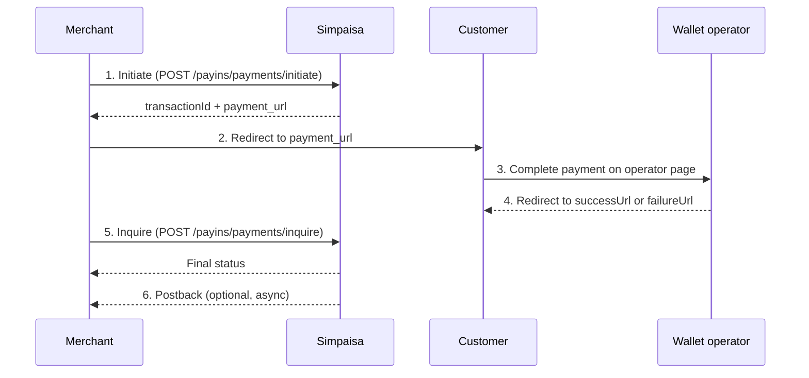

# overview

Accept customer payments through mobile wallets in **Bangladesh**, **Nepal**, **Egypt**, and **Iraq** using the same two REST APIs. Regional differences are limited to **headers** (region, operator) and **operator-specific configuration**—not separate endpoints or integration patterns.

> **Not covered here:** Pakistan pay-in uses a different API surface (`/v2/wallets/...`). See [Pakistan — Wallet APIs](../pakistan/wallets/overview.md).

***

## Payment flow

All unified regions follow a **redirect-based** flow.

> **Images:** The legacy BD, NP, EG, and IQ pay-in pages did not include flow diagrams. The sequence below replaces them. When you publish in GitBook, you can upload a region-neutral diagram to this page. All other diagrams from the existing docs are catalogued in [`IMAGE_CATALOG.md`](../../IMAGE_CATALOG.md) with original `/files/` IDs preserved for copy-paste into GitBook.



| Step | Action                                                        | API                                              |
| ---- | ------------------------------------------------------------- | ------------------------------------------------ |
| 1    | Create payment session                                        | [Initiate](initiate.md)                          |
| 2    | Redirect customer to `payment_url` from the Initiate response | —                                                |
| 3    | Customer pays on the wallet operator's page                   | —                                                |
| 4    | Customer lands on your `successUrl` or `failureUrl`           | —                                                |
| 5    | Confirm final status server-side                              | [Inquire](inquire.md)                            |
| 6    | Receive async notification (if configured)                    | [Webhooks](../../platform-reference/webhooks.md) |


Always call **Inquire** on your success/failure landing page. Do not treat the redirect alone as proof of payment. Status `0037` (Transaction-Pending) means the customer has not finished paying yet.


***

## APIs at a glance

| API              | Method | Path                        |
| ---------------- | ------ | --------------------------- |
| Initiate Payment | `POST` | `/payins/payments/initiate` |
| Inquire Payment  | `POST` | `/payins/payments/inquire`  |

***

## Environments

| Environment | Base URL                       |
| ----------- | ------------------------------ |
| Sandbox     | `https://sandbox.simpaisa.com` |
| Production  | `https://payin.simpaisa.com`   |

***

## Regional configuration

Set these values per region and operator. Use the same `merchantId` in sandbox and production.

| Region     | `region` header | Currency | Operators | `operatorId` / body `operator` |
| ---------- | --------------- | -------- | --------- | ------------------------------ |
| Bangladesh | `BD`            | BDT      | bKash     | `10001`                        |
| Bangladesh | `BD`            | BDT      | Nagad     | `10002`                        |
| Nepal      | `NP`            | NPR      | Khalti    | `100025`                       |
| Egypt      | `EG`            | EGP      | Paymob    | `100026`                       |
| Iraq       | `IQ`            | IQD      | Wayl      | `100027`                       |

### Common request headers

| Header         | Value                                              | Required |
| -------------- | -------------------------------------------------- | -------- |
| `Accept`       | `text/plain, application/json, application/*+json` | Yes      |
| `Content-Type` | `application/json`                                 | Yes      |
| `api-token`    | API token issued by Simpaisa                       | Yes      |
| `mode`         | `payin`                                            | Yes      |
| `region`       | `BD` · `NP` · `EG` · `IQ`                          | Yes      |
| `operatorId`   | Operator code from table above                     | Yes      |
| `version`      | `3.0`                                              | Yes      |


Pass the operator in **both** the `operatorId` header and the request body (`operator` or `operatorId` field, depending on region—see [Initiate](initiate.md) samples).


***

## Authentication

Unified pay-in regions authenticate with an **`api-token`** header or **Signature**. Simpaisa provides this token with your merchant credentials during onboarding.

For webhook setup and postback handling, see [Webhooks](../../platform-reference/webhooks.md).

***

## Operator use cases

Each operator uses the same Initiate and Inquire APIs. Examples with region-specific payloads:

| Operator | Region     | Guide                                   |
| -------- | ---------- | --------------------------------------- |
| bKash    | Bangladesh | [Use case: bKash](use-cases/bkash.md)   |
| Nagad    | Bangladesh | [Use case: Nagad](use-cases/nagad.md)   |
| Khalti   | Nepal      | [Use case: Khalti](use-cases/khalti.md) |
| Paymob   | Egypt      | [Use case: Paymob](use-cases/paymob.md) |
| Wayl     | Iraq       | [Use case: Wayl](use-cases/wayl.md)     |

***

## Postbacks

When a transaction reaches a final state, Simpaisa sends an HTTP `POST` to your configured callback URL.

Postbacks are sent when:

* A transaction completes (success or failure)
* An async payment cycle completes

### Sample success postback

```json
{
  "status": "0000",
  "message": "Success",
  "transactionId": "1423487",
  "merchantId": "4000006",
  "amount": "365.0",
  "msisdn": "1632332883",
  "userKey": "BDTb95a870f04403992d5034a2d201d2",
  "operator": "10001",
  "transactionType": "0",
  "createdTimestamp": "2025-09-19 16:15:53.0",
  "updatedTimestamp": "2025-09-19 16:17:07.187",
  "currencyCode": "BDT"
}
```

### Sample failure postback

```json
{
  "status": "0021",
  "message": "Channel-Failed-Transaction",
  "transactionId": "1423024",
  "merchantId": "4000006",
  "amount": "150.00",
  "msisdn": "1632332883",
  "operator": "10001",
  "userKey": "BDT8a4d2e2e248558adf9c5da0e7ceaa",
  "transactionType": "0",
  "createdTimestamp": "2025-09-19 15:59:59.0",
  "updatedTimestamp": "2025-09-19 16:00:00.0",
  "currencyCode": "BDT"
}
```

Use postbacks together with **Inquire**—treat Inquire as the source of truth when reconciling orders.

***

## Status codes

See [Unified Pay-In status codes](../../platform-reference/status-codes/pay-in-unified.md).

Key codes:

| Code   | Message                    | Meaning                            |
| ------ | -------------------------- | ---------------------------------- |
| `0000` | Success                    | Payment completed                  |
| `0037` | Transaction-Pending        | Customer has not finished paying   |
| `0021` | Channel-Failed-Transaction | Operator rejected the payment      |
| `0101` | Invalid-Credential         | Check `api-token` and `merchantId` |

***

## Getting started

1. Request sandbox credentials and `api-token` from the Simpaisa integration team.
2. Configure your postback URL.
3. Implement [Initiate](initiate.md) → redirect → [Inquire](inquire.md).
4. Test each operator you plan to go live with using the use-case guides above.
5. Move to production (`payin.simpaisa.com`) after sign-off.
